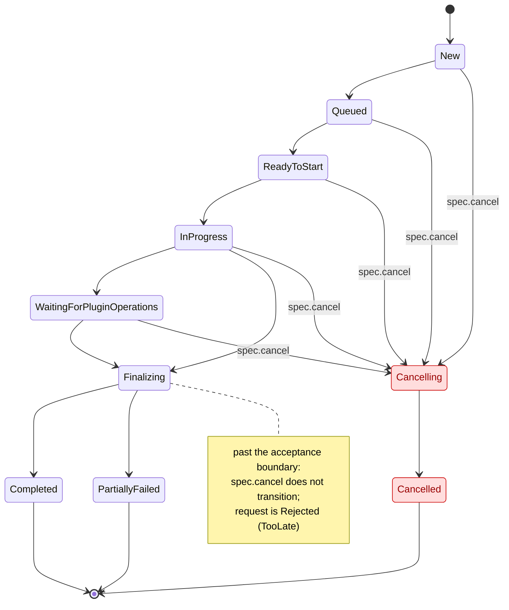
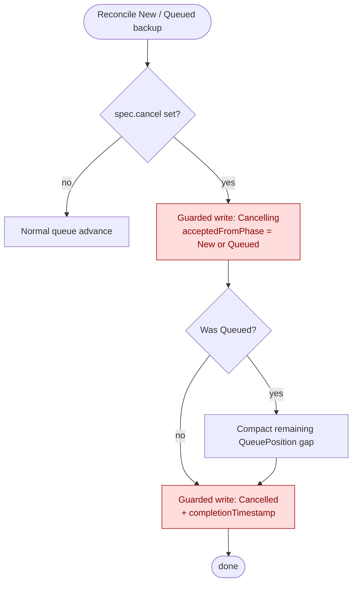
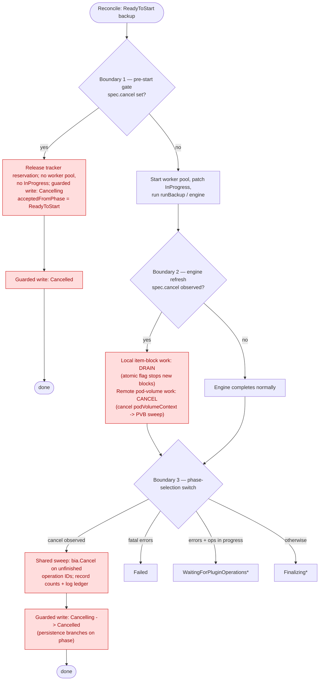
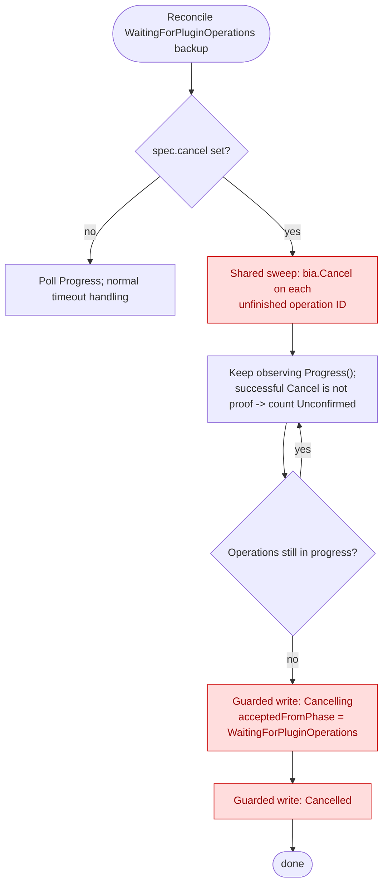
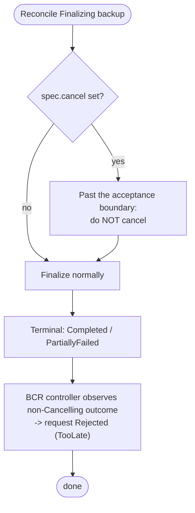
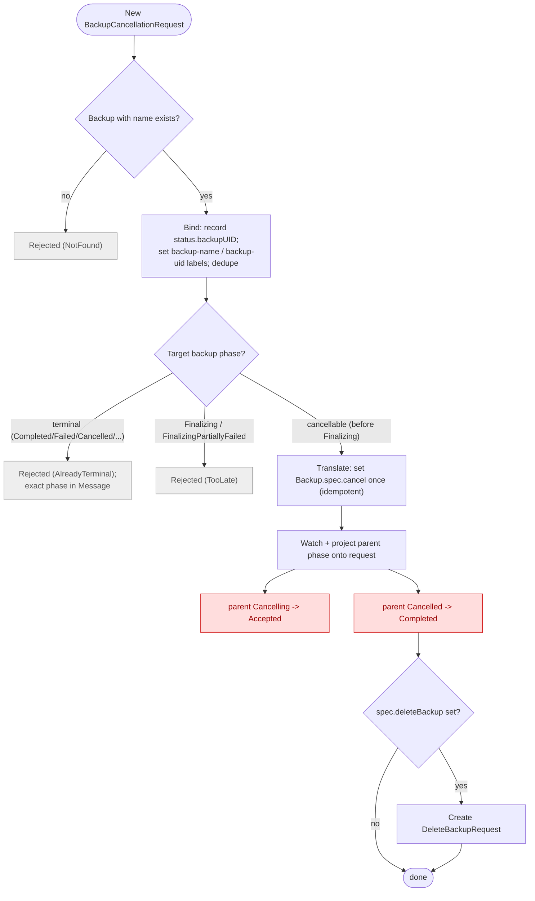

# Backup Cancellation

## Abstract

This proposal adds a supported way to cancel an in-progress Velero backup, stopping further work where possible and retaining the Backup object and any available artifacts for diagnosis.
Today a backup cannot be stopped once it is running: there is no cooperative cancellation path, so a user's only recourse is to delete or kill the workload, which can strand child operations, leave applications quiesced by pre-hooks, and produce partial artifacts that nothing accounts for.

## Background

A Velero backup progresses through a series of phases owned by different controllers: the backup queue controller advances `New -> Queued -> ReadyToStart`, and the backup controller then runs `InProgress` through a single blocking `runBackup()` call before handing off to waiting-for-plugin-operations, finalization, and a terminal phase.
Cancellation is difficult because a backup is not a single unit of work: `runBackup()` performs synchronous item collection and archiving, waits on asynchronous node-side child work (pod-volume backups and CSI data uploads), and starts durable asynchronous plugin operations that are polled to completion by a separate controller.
A busy reconcile cannot be interrupted by another event for the same object, so stopping a backup requires cooperative checkpoints inside the running work plus durable intent that survives process restarts, not merely a controller that observes a request.

A prototype exists on the `backup-cancellation` branch, and the approach was previously discussed in design PR [#9284](https://github.com/velero-io/velero/pull/9284).
That prototype introduced a `spec.cancel` field, cancellation phases, cooperative engine checkpoints, and a cancellation reconciler, but it predates main's backup queueing, per-request worker pools, and pod-volume-backup timeout fixes.
This design builds on the lessons from that prototype and the accompanying research rather than adopting it directly.

## Goals

- Provide a supported way to cancel an in-progress backup that stops further work where possible and retains the Backup object and any available artifacts for diagnosis.
- Ensure cancellation is safe: it never leaves the Backup in an inconsistent state, and a stale engine, finalizer, or operations write cannot overwrite an accepted cancellation outcome.

## Non Goals

- Restore cancellation.
- Rolling back or undoing work that has already been applied; a completed synchronous action or an already-running plugin call cannot be reversed by cancellation.
- A hard, real-time interruption guarantee; cancellation is cooperative and best-effort, not a deadline enforced against arbitrary blocking work.
- Provider-enforced write fencing; this design does not attempt to prove that a plugin's external work has truly stopped, which would require storage/plugin changes out of scope here.
- Deleting stored backup artifacts; deletion is a possible follow-up that cancellation configuration could trigger, but the cancellation implementation itself does not take on a sub-deletion task, and stored data removal remains with `velero backup delete`.

## High-Level Design

Cancellation intent is expressed by creating a new `BackupCancellationRequest` custom resource rather than by users patching the Backup directly.
The request names a target Backup and is bound to that Backup's UID, so a request cannot be satisfied by a later object that reuses the same name, and it gives the operation a durable place to carry configuration and record request, acceptance, and completion outcomes.
The request controller translates an accepted request into `Backup.spec.cancel`, which is the internal signal the backup controllers observe; users do not set `spec.cancel` themselves.
Creating the request is a signal of intent only; a backup is not considered cancelled until a controller records acceptance in the parent Backup's status, and once accepted the outcome is authoritative and cannot be resumed.

Cancellation teardown is observer-owned rather than driven by a single coordinator.
A Backup's phases are each owned by a different controller, and whichever controller owns the phase a backup is in observes `spec.cancel`, tears down the work in flight at that phase, records the `Cancelling` phase and cancellation status on the parent, and drives the Backup to the terminal `Cancelled` phase.
The `BackupCancellationRequest` controller does not coordinate teardown itself; it resolves and UID-binds the target, translates the request into `spec.cancel`, and mirrors the parent's outcome back onto the request for observation and audit.
Cancellation may also carry a configurable timeout — resolved from a server-level default with an optional per-request override and recorded on the parent as a deadline — intended to bound how long cancellation orchestration runs.
Whether this can be implemented, and how it would be enforced at the deadline, is still open; it is a possibility this design keeps room for rather than a committed behavior, and it is explored further in the Detailed Design.

The phases a backup moves through, and where cancellation can be accepted versus rejected, are summarized below.
Cancellation is accepted from any phase up to and including `WaitingForPluginOperations`; once a backup reaches `Finalizing` it is past the acceptance boundary and the request is rejected.
The `PartiallyFailed` variants (`WaitingForPluginOperationsPartiallyFailed`, `FinalizingPartiallyFailed`) behave like their siblings and are omitted for readability.



## Detailed Design

<!-- Names of types, fields, phases, CRDs, and YAML settled here. -->

### API: BackupCancellationRequest CRD

A `BackupCancellationRequest` is a namespaced custom resource in the `velero.io/v1` group, following the same shape as the existing `DeleteBackupRequest` and `DownloadRequest`.
Its spec names the target Backup; its status carries a lifecycle phase, the resolved target UID that binds the request, a rejection reason when applicable, and a human-readable message.
The authoritative cancellation details (acceptance time, the phase cancellation was accepted from, the outcome reason, and bounded teardown counts) live on the parent Backup's `status.cancellation`, described in the next section; the request controller observes those and reflects them through the request phase rather than duplicating them.

```go
// BackupCancellationRequestSpec is the specification for a request to cancel a backup.
type BackupCancellationRequestSpec struct {
	// BackupName is the name of the backup to cancel.
	BackupName string `json:"backupName"`

	// TimeoutSeconds optionally overrides the server-level cancellation timeout for this
	// request. Tentative: the cancellation deadline mechanism is not yet designed, so this
	// field may be ignored until enforcement is defined (the deadline mechanism is still open).
	// +optional
	TimeoutSeconds *int64 `json:"timeoutSeconds,omitempty"`

	// DeleteBackup, when true, requests that the backup be deleted after cancellation completes
	// successfully. The request controller creates a DeleteBackupRequest once the backup reaches
	// Cancelled; it is not applied when the request is Rejected. See Cleanup.
	// +optional
	DeleteBackup bool `json:"deleteBackup,omitempty"`
}

// BackupCancellationRequestPhase represents the lifecycle phase of a BackupCancellationRequest.
// +kubebuilder:validation:Enum=New;Accepted;Completed;Rejected
type BackupCancellationRequestPhase string

const (
	// BackupCancellationRequestPhaseNew means the request has been observed but the backup
	// controller has not yet recorded acceptance on the target Backup.
	BackupCancellationRequestPhaseNew BackupCancellationRequestPhase = "New"

	// BackupCancellationRequestPhaseAccepted means a phase owner recorded the Cancelling
	// phase on the target Backup; the outcome is now authoritative.
	BackupCancellationRequestPhaseAccepted BackupCancellationRequestPhase = "Accepted"

	// BackupCancellationRequestPhaseCompleted means the target Backup reached the terminal
	// Cancelled phase.
	BackupCancellationRequestPhaseCompleted BackupCancellationRequestPhase = "Completed"

	// BackupCancellationRequestPhaseRejected means the request could not be honored; the reason
	// (see Status.Reason) distinguishes why.
	BackupCancellationRequestPhaseRejected BackupCancellationRequestPhase = "Rejected"
)

// BackupCancellationRequestRejectedReason explains why a request was Rejected.
// +kubebuilder:validation:Enum=TooLate;AlreadyTerminal;NotFound
type BackupCancellationRequestRejectedReason string

const (
	// RejectedReasonTooLate means the target Backup was still running but past the acceptance
	// boundary (Finalizing or FinalizingPartiallyFailed) when the request was processed.
	RejectedReasonTooLate BackupCancellationRequestRejectedReason = "TooLate"

	// RejectedReasonAlreadyTerminal means the target Backup had already reached a terminal phase
	// (for example Completed, PartiallyFailed, Failed, FailedValidation, or Cancelled). Message
	// records the exact phase.
	RejectedReasonAlreadyTerminal BackupCancellationRequestRejectedReason = "AlreadyTerminal"

	// RejectedReasonNotFound means no Backup with the requested name existed when the request was
	// bound.
	RejectedReasonNotFound BackupCancellationRequestRejectedReason = "NotFound"
)

// BackupCancellationRequestStatus is the current status of a BackupCancellationRequest.
type BackupCancellationRequestStatus struct {
	// Phase is the current state of the request.
	// +optional
	Phase BackupCancellationRequestPhase `json:"phase,omitempty"`

	// BackupUID is the UID of the target Backup resolved when the request was bound. A request
	// is only acted on for the Backup with this UID, so a later Backup that reuses the same
	// name cannot satisfy or be affected by this request.
	// +optional
	BackupUID string `json:"backupUID,omitempty"`

	// Reason is set when Phase is Rejected and categorizes why the request could not be honored.
	// +optional
	Reason BackupCancellationRequestRejectedReason `json:"reason,omitempty"`

	// Message is a human-readable explanation of the current phase, such as the exact terminal
	// phase behind an AlreadyTerminal rejection.
	// +optional
	Message string `json:"message,omitempty"`
}
```

The object wrapper carries the standard markers and print columns, mirroring the existing request CRDs (proposed short name `bcr`):

```go
// +genclient
// +k8s:deepcopy-gen:interfaces=k8s.io/apimachinery/pkg/runtime.Object
// +kubebuilder:object:root=true
// +kubebuilder:object:generate=true
// +kubebuilder:storageversion
// +kubebuilder:resource:shortName=bcr
// +kubebuilder:printcolumn:name="BackupName",type="string",JSONPath=".spec.backupName"
// +kubebuilder:printcolumn:name="Status",type="string",JSONPath=".status.phase"
// +kubebuilder:printcolumn:name="Reason",type="string",JSONPath=".status.reason"
// +kubebuilder:printcolumn:name="Age",type="date",JSONPath=".metadata.creationTimestamp"

// BackupCancellationRequest is a request to cancel an in-progress backup.
type BackupCancellationRequest struct {
	metav1.TypeMeta `json:",inline"`
	// +optional
	metav1.ObjectMeta `json:"metadata,omitempty"`
	// +optional
	Spec BackupCancellationRequestSpec `json:"spec,omitempty"`
	// +optional
	Status BackupCancellationRequestStatus `json:"status,omitempty"`
}
```

The request is bound to the target on first observation by resolving the named Backup and recording its UID in `status.backupUID`.
Association with the Backup for listing and cleanup follows the existing convention of a `velero.io/backup-name` label, matching `DeleteBackupRequest`.

### Parent Backup status and phases

Two phases are added to `BackupPhase`, and they are the authoritative record of cancellation.

```go
// BackupPhaseCancelling means cancellation has been accepted for an in-progress backup and
// the controller is tearing down its work. The backup is not usable.
BackupPhaseCancelling BackupPhase = "Cancelling"

// BackupPhaseCancelled means the backup was cancelled. It is a terminal phase and cannot be
// resumed. Available artifacts are retained for diagnosis but the backup is not restorable.
BackupPhaseCancelled BackupPhase = "Cancelled"
```

`Cancelling` is recorded by whichever controller owns the phase where cancellation is accepted, and recording it is what makes cancellation authoritative; `Cancelled` is the terminal phase.
These parent spellings are `Cancelling`/`Cancelled`, distinct from the existing child spellings `Canceling`/`Canceled` used by DataUpload and PodVolumeBackup, which are handled through adapters rather than renamed (see Compatibility).

A `cancellation` structure is added to `BackupStatus`, populated only after acceptance, holding the outcome, where in the lifecycle cancellation landed, and bounded counts of the teardown attempted.
The existing `completionTimestamp` is reused for the final completion time rather than adding a duplicate.
The structure deliberately holds only fixed-size fields: a backup can start hundreds or thousands of child operations, so an open-ended per-operation list on the Backup object risks exceeding the Kubernetes object size limit, exactly as the existing per-operation data does.
Velero already avoids this for operations by keeping only counts on the Backup status (`BackupItemOperationsAttempted`/`Completed`/`Failed`) while the per-operation detail lives in an object-storage artifact; cancellation follows the same split (see Diagnostics and artifacts).

```go
// Cancellation records the outcome of a cancellation. It is set only once cancellation has
// been accepted (the phase is Cancelling or Cancelled).
// +optional
// +nullable
Cancellation *BackupCancellationStatus `json:"cancellation,omitempty"`
```

```go
// BackupCancellationStatus records the outcome of cancelling a backup.
type BackupCancellationStatus struct {
	// AcceptedAt is when the controller accepted cancellation and recorded the Cancelling phase.
	// +optional
	// +nullable
	AcceptedAt *metav1.Time `json:"acceptedAt,omitempty"`

	// Deadline is the point by which cancellation orchestration is intended to finish.
	// Tentative: the deadline mechanism and its enforcement are not yet designed, so this field
	// may be unset until that is resolved (the deadline mechanism is still open).
	// +optional
	// +nullable
	Deadline *metav1.Time `json:"deadline,omitempty"`

	// Reason is a short, human-readable summary of the final cancellation outcome, complementing
	// the bounded counts below (for example noting that some teardown remained unconfirmed).
	// +optional
	Reason string `json:"reason,omitempty"`

	// AcceptedFromPhase records the phase the backup was in when cancellation was accepted,
	// indicating where in the lifecycle cancellation landed (for example a pre-start phase,
	// InProgress, WaitingForPluginOperations, or Finalizing).
	// +optional
	AcceptedFromPhase BackupPhase `json:"acceptedFromPhase,omitempty"`

	// ActionsAttempted is how many teardown actions cancellation tried (child and plugin-operation
	// cancellation calls, hook cleanup, and so on).
	// +optional
	ActionsAttempted int `json:"actionsAttempted,omitempty"`

	// ActionsConfirmed is how many of those actions Velero confirmed completed.
	// +optional
	ActionsConfirmed int `json:"actionsConfirmed,omitempty"`

	// ActionsUnconfirmed is how many actions Velero could not verify actually stopped the work,
	// so that unresolved teardown remains visible after the backup is Cancelled.
	// +optional
	ActionsUnconfirmed int `json:"actionsUnconfirmed,omitempty"`
}
```

The status carries only these bounded counts so it cannot grow with the number of child operations.
The per-action detail — the name of each teardown step and whether it was confirmed, skipped, failed, or unconfirmed — is written to the backup log (which is already persisted to object storage) rather than onto the Backup object, mirroring how per-operation data is handled today (see Diagnostics and artifacts).
The `ActionsUnconfirmed` count preserves the honesty required by the safety goal: a successful child or plugin `Cancel` call is recorded as attempted, not as proof that remote work stopped, and any such case is both counted here and detailed in the log.

### Cancellation across the controllers

The `BackupCancellationRequest` is the durable, user-facing intent; the request controller translates it into `Backup.spec.cancel`, and the backup controllers observe `spec.cancel` to act.
This keeps the request as the audit and configuration surface while reusing a single signal on the Backup that every phase owner already has access to.

The technical goal is the same regardless of which controller observes the signal: **move the Backup to `Cancelling`, perform the teardown required for the work in flight at that phase, then move it to `Cancelled`.**
The governing principle is **observer-owned teardown**: because a Backup's phases are owned by different controllers, whichever controller owns the current phase is the one that observes `spec.cancel`, does the teardown for whatever is in flight at that phase, and drives the transition — there is no central coordinator reaching across phases into another controller's work.
The amount of teardown between `Cancelling` and `Cancelled` grows the further along the lifecycle cancellation is observed, from nothing before work starts to child and plugin-operation teardown once work is in flight.
Observer-owned means each phase owner *triggers and transitions*; it does not mean each one reimplements teardown.
The only teardown that more than one controller performs is cancelling in-flight plugin operations via `bia.Cancel()` on their recorded operation IDs; that is a shared helper the backup controller and the operations controller both invoke, so they run the same operation-cancellation logic rather than duplicating it.
Pod-volume-backup teardown is not in this shared set because PodVolumeBackups only exist, and are only tracked, inside the engine, so their cancellation happens there alone (described under the backup controller); by later phases they are already terminal.
Every transition that records a phase must be guarded: a fresh read plus an optimistic-lock (resourceVersion precondition) update, recomputing on conflict, so exactly one transition wins and a stale engine, finalizer, or operations write cannot overwrite an accepted cancellation outcome.
This guarding is the mechanism behind the safety goal; the existing retry helper that replays a cached snapshot is insufficient and must not be used for these transitions.

Cancellation is accepted only while there is still stoppable work: through `WaitingForPluginOperations`.
Once a backup reaches `Finalizing` — where the data is already captured and only results are being written — or any terminal phase, the request is `Rejected` (reason `TooLate` for `Finalizing`/`FinalizingPartiallyFailed`, `AlreadyTerminal` otherwise; see the Finalizer and BackupCancellationRequest controller sections).

The transition from `Cancelling` to `Cancelled` is deliberately **fast and request-based rather than confirmation-based**: `Cancelled` means teardown was *requested*, not proven to have stopped on the node side.
Plugin-operation cancellation (`bia.Cancel()`) only requests a stop, so those are recorded as `ActionsUnconfirmed`; pod-volume backups are the exception, since the engine already waits for them to reach `Canceled` before returning, so they are confirmed.
Because the transition does not wait on remote confirmation, `Cancelling` is often brief and a user may never observe it; its duration is dominated by the engine's synchronous pod-volume wait, so it is most visible for large filesystem-backup backups and near-instant otherwise.
`Cancelling` is nonetheless a real, persisted phase, not a cosmetic one: it is the atomicity point that lets acceptance win the guarded race, and the crash-recovery anchor that tells a restarting controller to re-drive teardown to `Cancelled` rather than resume the backup.

The following sections take each controller in lifecycle order and describe, for the phases it owns: how it observes cancellation, the steps required, and the transition to `Cancelled` (or handoff to the next owner).

#### Queue controller (New, Queued)

*Owns `"" `/`New` -> `Queued` and `Queued` -> `ReadyToStart`. At these phases no worker pool, children, or plugin operations exist, and the backup tracker only reserves capacity at the `Queued` -> `ReadyToStart` transition (`AddReadyToStart`), so a cancellation here has nothing in flight to unwind.*



**Observe.**
The reconciler is a phase `switch` driven by create/update events for `New` backups and a periodic requeue of `Queued` backups (`defaultQueuedBackupRecheckFrequency`, one minute).
To observe cancellation promptly rather than at up to the one-minute requeue, the watch predicates gain a case for `spec.cancel` becoming true on a `New` or `Queued` backup.

**Steps.**
Because nothing is in flight, the required teardown is only bookkeeping:

- Record the guarded transition to `Cancelling` with `acceptedFromPhase` set to `New` or `Queued`.
- If the backup was `Queued`, compact the remaining queued backups' `QueuePosition` values just as the normal dequeue path does, so cancellation does not leave a gap.
- No tracker entry exists yet to release, since `AddReadyToStart` has not run; the reconciler must not add one for a backup it is cancelling.

**Transition to Cancelled.**
There is no child or operation work to settle, so the queue controller can record the terminal `Cancelled` phase (and `completionTimestamp`) immediately after `Cancelling`, again via a guarded update.
These pre-start transitions must use an optimistic-locked update rather than the existing `kube.PatchResource` helper this controller uses today, which replays a cached snapshot and is unsafe for the cancellation race.

#### Backup controller (ReadyToStart, InProgress)

*Owns the `ReadyToStart` gate, the `ReadyToStart` -> `InProgress` transition, and the single blocking `runBackup()` call. Its `Reconcile` only accepts events for `ReadyToStart` backups and then blocks in `runBackup()`, so once a backup is `InProgress` no watch event can re-enter for that key until the call returns. It also owns the worker pool (created in `prepareBackupRequest`, torn down by a deferred `StopWorkerPool()`) and the running-backup tracker entry.*

Cancellation is checked at three boundaries only, rather than scattered throughout the controller; a small number of meaningful boundaries plus the engine's cooperative wind-down is preferred over ad-hoc checks that every future code path would have to remember.



**1. Pre-start gate (observe, event-driven).**
Immediately after the reconciler gets a `ReadyToStart` backup, before `prepareBackupRequest` builds the request or starts a worker pool, it checks `spec.cancel`.
This is the clean pre-start acceptance: nothing is in flight, so the only teardown is bookkeeping — the reconciler must release the tracker reservation the queue controller made with `AddReadyToStart`, must not create a worker pool or patch `InProgress`, and records the guarded transition to `Cancelling` with `acceptedFromPhase: ReadyToStart`.
Because no child or operation work exists, it proceeds to `Cancelled` directly.

**2. Engine-owned refresh (observe, in-flight).**
This is the most involved part of the design and is treated separately in the backup engine (`pkg/backup/backup.go`), which runs a producer loop feeding a per-backup worker pool and, separately, waits on node-side pod-volume backups with no backup-cancellation awareness today.
The engine re-reads `spec.cancel` itself (a rate-limited refresh, since it takes no context from the reconciler), and the wind-down is a **hybrid** that treats the local work and the remote work differently, because the two want opposite things.

*Local work — the item-block producer and worker pool — drains.*
An atomic flag checked at the producer loop top stops submitting new item blocks and lets the blocks already in flight finish, relying on the existing deferred `StopWorkerPool()` to tear the pool down normally.
A flag is used rather than a context deliberately: drain-then-stop wants the in-flight waits and the worker-return path to *complete*, whereas a context's defining power is to interrupt exactly those, so a context here would risk short-circuiting the drain (and deadlocking the result consumer on its blocking return send).
Any item whose action had already started keeps running to the next boundary so its operation ID is recorded and remains discoverable for the plugin-operation teardown below.

*Remote work — the pod-volume backups — is cancelled, not drained.*
Pod-volume backups are the expensive node-agent data copy, so cancellation must stop them rather than wait them out.
The engine already has exactly this path: `WaitAllPodVolumesProcessed` selects on `podVolumeContext.Done()` and, when it fires, sets `Spec.Cancel = true` on every tracked PodVolumeBackup that is not already terminal, then waits for them to reach `Canceled`.
Today that path is driven only by the pod-volume timeout; cancellation reuses it unchanged by also cancelling `podVolumeContext` when `spec.cancel` is observed.
This is the one place a context (not a flag) is correct, precisely because here we *do* want to interrupt the wait — and it means no new PodVolumeBackup teardown helper is needed, since the engine already tracks its own PVBs and sets their cancel field.

**3. Phase-selection transition (transition).**
After the engine returns, `runBackup()` selects the handoff phase in a `switch` on fatal errors, logged-error counts, and in-progress operations.
Cancellation must be a first-class case in that switch, evaluated ahead of the error and operation cases, so a cancelled backup routes to `Cancelling` rather than losing to normal partial-failure or finalization routing.
In particular, the engine may have started asynchronous plugin operations that are still in progress at this point; the unmodified switch would route those to `WaitingForPluginOperations`, which would *wait for* the cancelled work instead of stopping it.
Because the backup controller already holds the plugin manager and the operation list here (it calls `getBackupItemOperationProgress` over them), it runs the shared teardown sweep in place — `bia.Cancel()` on each unfinished operation ID — recording the counts on `status.cancellation` and the per-action detail in the log, then transitions toward `Cancelled`.
The subsequent artifact persistence must branch on that phase so a cancelled backup does not publish usable terminal metadata, and the phase must be written with a guarded optimistic-lock update rather than the `PatchResourceWithRetriesOnErrors` helper used today, which replays a cached snapshot and is unsafe for the cancellation race.
The deferred tracker handling (which today only covers terminal, waiting, and finalizing phases) must gain cases for `Cancelling`/`Cancelled` so a cancelled backup releases or transfers its tracker entry correctly rather than leaking it.

*Two lower-value refinements were considered and deprioritized: a check just before `BackupWithResolvers` (largely redundant once the pre-start gate and early engine checks exist) and a separate check just before upload (folded into how the phase-selection outcome is persisted).*

#### Operations controller (WaitingForPluginOperations)

This controller already reconciles waiting backups periodically, and it already knows how to cancel in-flight plugin operations: the operation-timeout path calls `bia.Cancel(operationID, backup)` and marks the operation terminal.
Cancellation reuses that exact mechanism — the shared teardown sweep — triggered by `spec.cancel` instead of the timeout, so this controller does not need new operation-cancellation logic, only a new trigger.
It attempts `Cancel()` on each unfinished operation using its recorded operation ID and keeps observing `Progress()` rather than treating a successful `Cancel()` return as proof the remote work stopped, since the plugin interface permits unsupported cancellation to return successfully; such cases are counted as `ActionsUnconfirmed` and detailed in the log.
Modes with no meaningful cancellation path (for example native snapshots) are handled by stopping new calls and recording the in-flight work as unconfirmed.
When no operations remain in progress it records the guarded transition to `Cancelling` with `acceptedFromPhase: WaitingForPluginOperations`, then on to `Cancelled`.



#### Finalizer controller (Finalizing)

*Owns `Finalizing`. By this phase the backup's data is already captured and its asynchronous operations are already complete; finalization only updates operation results and uploads the final artifact, so there is no expensive or reversible work left to stop.*

The finalizer controller does not accept cancellation.
`Finalizing` is past the acceptance boundary, so cancelling here would abandon a nearly-finished backup for no benefit, leaving a half-finalized artifact instead of a usable one; letting finalization complete is both simpler and more honest.
This requires no cancellation-specific code in the finalizer: the phase-selection transition (boundary 3) in the backup controller already makes `Cancelling` win the phase-selection switch ahead of the `Finalizing` case, so a backup only reaches `Finalizing` with `spec.cancel` set if the signal arrived *after* it already entered `Finalizing`.
In that case no controller attempts a `Cancelling` write, the backup finalizes normally to its terminal phase, and the `BackupCancellationRequest` controller observes the non-`Cancelling` outcome and records the request as `Rejected` with reason `TooLate`.



#### BackupCancellationRequest controller (new)

*Owns the `BackupCancellationRequest` lifecycle. It never writes the parent Backup's phase or `status.cancellation`; it raises the signal and then projects the parent's outcome back onto the request.*

The controller is deliberately thin — bind the target, raise the signal once, and mirror the parent's outcome:

- **Bind.** On first observation of a `New` request, resolve the named Backup, record its UID in `status.backupUID`, and set the `velero.io/backup-name` and `velero.io/backup-uid` labels (matching `DeleteBackupRequest`). The UID binding makes the request immune to a later Backup that reuses the same name. If no such Backup exists, the request is `Rejected` with reason `NotFound`.
- **Dedupe.** Redundant requests for the same bound Backup are collapsed so only one is acted on, following the `DeleteBackupRequest` convention of removing existing requests for the same backup.
- **Translate.** If the bound Backup is still in a cancellable phase (anything before `Finalizing`), set `Backup.spec.cancel` once, idempotently; this is the internal signal the phase owners observe. Setting it is not acceptance — acceptance is a phase owner recording `Cancelling`.
- **Reject if past the boundary.** If the bound Backup is already `Finalizing`/`FinalizingPartiallyFailed`, the request is `Rejected` with reason `TooLate`; if it is already in a terminal phase (`Completed`, `PartiallyFailed`, `Failed`, `FailedValidation`, or `Cancelled`), it is `Rejected` with reason `AlreadyTerminal` and the exact phase in `Message`.
- **Project.** Otherwise the controller watches the bound Backup and mirrors its phase onto the request: parent `Cancelling` -> `Accepted`, parent `Cancelled` -> `Completed`. Because the outcome is read from the parent rather than decided at signal-set time, the set-time race (the backup slipping into `Finalizing` before `spec.cancel` is observed) resolves correctly: the parent finalizes normally and the request lands on `Rejected`/`TooLate`.

It does not itself coordinate teardown; that is observer-owned by the phase controllers.



### Diagnostics and artifacts

The per-action cancellation ledger lives in the backup log, which is already persisted to object storage.
Each teardown step the controllers attempt — a plugin-operation `Cancel`, the pod-volume cancel sweep, and so on — is logged with its name, outcome (`Done`, `Skipped`, `Failed`, or `Unconfirmed`), and a message.
The Backup object itself keeps only the bounded `ActionsAttempted`/`Confirmed`/`Unconfirmed` counts, so an operator sees the summary on the object and the full detail in the log.

Whatever partial artifacts were written before cancellation are retained for diagnosis, consistent with the Goals, but the `Cancelled` phase marks the backup non-restorable so they are understood as diagnostic-only.
A cancelled backup still uploads its log and metadata so the outcome and ledger are durable, but the persistence step branches on the phase (at the phase-selection transition, boundary 3) so it does not publish usable terminal or restorable metadata for a cancelled backup.

### Cleanup

Cancellation does not delete stored backup artifacts itself; as stated in the Non Goals, stored-data removal stays with the existing deletion flow.
Instead, deletion is offered as an opt-in follow-up via the request's `spec.deleteBackup` field.
When it is set, the `BackupCancellationRequest` controller creates a `DeleteBackupRequest` for the backup once the backup reaches the terminal `Cancelled` phase (request `Completed`), reusing the existing deletion machinery rather than implementing any deletion logic here.
The follow-up fires only on successful cancellation; a `Rejected` request (too late, already terminal, or not found) does not trigger deletion, since the user asked to cancel-then-delete and no cancellation occurred.

Process-local resources created during a cancelled backup — the temporary backup tarball, the per-request worker pool, and plugin processes — need no cancellation-specific cleanup, because they are already released by the existing deferred teardown (`StopWorkerPool`, plugin manager cleanup, temp-file removal) that runs regardless of how `runBackup` returns.

### Hooks

Backup pre- and post-hooks require no special cancellation handling.
Hooks run inside `backupItemBlock`, which a worker executes to completion once it has picked up the block; the drain-then-stop boundary is *between* item blocks (the producer stops submitting new blocks), never inside one.
So a block that has started always runs its pre-hooks, items, and paired post-hooks together — cancellation cannot land between a pre-hook and its post-hook, and cannot leave an application quiesced by a pre-hook without the matching post-hook.

### CLI, metrics, and sync

A `velero backup cancel BACKUP_NAME` command creates a `BackupCancellationRequest` for the named backup.
It accepts `--wait` to block until the request reaches a terminal phase (`Completed` or `Rejected`) and `--delete` to set `spec.deleteBackup`; if the tentative timeout is adopted it would also accept `--timeout`.
`velero backup describe` surfaces the `Cancelling`/`Cancelled` phase and the `status.cancellation` counts, and `velero backup logs` includes the teardown ledger so the per-action detail is reachable without cluster access to the log.

Metrics record cancellation outcomes alongside the existing backup metrics — at least a counter of cancelled backups, usefully labeled by `acceptedFromPhase` so operators can see where cancellations tend to land.

Backup sync must treat `Cancelled` as a terminal, non-restorable phase: the object is synced for visibility and auditing, but is not presented as a restore source, consistent with the restore gate described under Compatibility.

## Alternatives Considered

**A user-facing `Backup.spec.cancel` field instead of a request CR.**
The simplest intent API would be to let users patch `spec.cancel` on the Backup directly.
This was rejected as the *user-facing* surface because it offers no place to carry per-request configuration (follow-up deletion, an optional timeout), no durable record of who requested cancellation and when, and no clean way to express a request that arrives too late.
A dedicated `BackupCancellationRequest` gives intent its own auditable, UID-bound object with request/accepted/rejected outcomes, while `spec.cancel` is retained purely as the internal signal the request controller sets and the phase owners observe.

**A central cancellation coordinator instead of observer-owned teardown.**
An alternative is a single controller that watches for cancellation and drives teardown across every phase of the backup.
This was rejected because a Backup's phases are already owned by distinct controllers, and a central coordinator would have to reach into each phase's in-flight work (the engine's worker pool, the operations poll) that it does not own, duplicating logic and racing the owning controller.
Observer-owned teardown instead has whichever controller owns the current phase observe `spec.cancel` and tear down its own work, which keeps each piece of teardown next to the code that understands it and makes the guarded phase transitions naturally single-writer.

**Hard abort instead of drain-then-stop in the engine.**
The engine could try to abort in-flight item blocks immediately — closing the worker pool or cancelling a context that interrupts the result consumer.
This was rejected because the worker's result send is blocking and unguarded, so interrupting mid-flight risks deadlocking the pool shutdown, and because aborting local work buys little: the expensive work is the remote node-agent copy, which a local abort does not stop.
Drain-then-stop instead stops submitting new blocks and lets in-flight blocks complete, implemented with an atomic flag rather than a context so the in-flight waits and the worker-return path are allowed to finish; a context is used only for the pod-volume wait, where interrupting is exactly what triggers the existing PodVolumeBackup cancel sweep.

**An inline `actions[]` list on the Backup status instead of counts.**
Recording each teardown action as a structured entry on `status.cancellation` would put the full ledger on the Backup object.
This was rejected because a backup can start thousands of child operations, so an open-ended list risks exceeding the Kubernetes object size limit, exactly the reason per-operation data is already kept off the Backup today.
The status carries only bounded counts (`ActionsAttempted`/`Confirmed`/`Unconfirmed`), and the per-action detail is written to the backup log.

**Confirmation-based `Cancelled` instead of a fast, request-based transition.**
The controller could hold the backup in `Cancelling` until it observes every cancelled child and operation reach a terminal state before writing `Cancelled`.
This was rejected as the default because it makes the terminal transition depend on remote work Velero cannot always confirm (a plugin whose `Cancel` is a no-op, a native snapshot), which would require a bounding timeout to avoid wedging in `Cancelling`.
`Cancelled` instead means teardown was *requested*: pod-volume backups are confirmed (the engine already waits for them), plugin operations are requested and counted `Unconfirmed`, and the honest outcome is recorded without blocking on unconfirmable work.

## Security Considerations

The cancellation privilege is the ability to create a `BackupCancellationRequest`, controlled by normal Kubernetes RBAC on that resource, in the same way `DeleteBackupRequest` gates deletion.
`Backup.spec.cancel` is an internal signal set by the request controller, not a user-facing field; users are expected to cancel through the request, which gives the audited, UID-bound path.
Because the phase owners honor `spec.cancel` wherever it comes from, anyone with write access to the Backup object can in effect cancel it by setting the field directly; this design treats Backup-write as sufficient for cancellation rather than adding a validating webhook to forbid direct edits, though such a webhook is a possible hardening (see Open Issues).

The `spec.deleteBackup` option escalates a cancellation into a deletion.
This does not bypass deletion controls: the request controller creates a `DeleteBackupRequest`, so deletion still runs through the existing deletion flow and its checks (for example a read-only or unavailable backup storage location).
Operators should nonetheless be aware that granting create access to `BackupCancellationRequest` with this option effectively grants deletion of the target backup.

## Compatibility

<!-- Server/CRD/CLI/node-agent feature matching; Schedule template handling; child spelling Canceling/Canceled adapters. -->

**Cancelled is not a restore source.**
The restore controller allowlists only `Completed` and `PartiallyFailed` backups as restore sources (`restore_controller.go`), so a `Cancelled` backup is already refused with "cannot be used as a restore source."
This design relies on that existing gate rather than adding `Cancelled` to the allowlist; the only change needed is to make the refusal explicit and intentional — a `Cancelled`-specific message — and to ensure backup sync and the CLI listing surface `Cancelled` as a terminal, non-restorable phase rather than an error or an omission.

**Child phase spellings.**
The parent uses `Cancelling`/`Cancelled`, while the existing child resources (DataUpload, PodVolumeBackup) use `Canceling`/`Canceled`.
These are intentionally left as-is and reconciled through adapters/mapping rather than renaming the child phases, to avoid a breaking change to the child CRDs and node-agent.

## Implementation

The work builds on the prototype on the `backup-cancellation` branch but is reworked for main's backup queueing, per-request worker pools, and pod-volume-backup timeout handling rather than ported directly.
It is broken into PR-sized pieces that can land incrementally, grouped into three phases.

The ordering principle that makes this safe to merge in pieces: `spec.cancel` defaults to false and no `BackupCancellationRequest` exists until a user creates one, so every observer added before the request path is **inert in normal operation** — it changes behavior only once something sets `spec.cancel`.
This lets all the teardown code land first, exercised only by tests that set `spec.cancel` directly, while the user-facing request path — the one thing that turns cancellation *on* — lands last, only after every phase already has an observer.
That way a user can never create a request that some phase silently ignores because its observer has not merged yet.

**Phase 1 — Foundations (inert plumbing).**

1. API types: add `spec.cancel` to `BackupSpec`, the `Cancelling`/`Cancelled` `BackupPhase` values, `BackupCancellationStatus` (counts-only), and the `BackupCancellationRequest` CRD, with generated clients and CRD manifests. Pure additions; no controller reads or writes them yet.
2. A guarded phase-transition helper (fresh read plus optimistic-lock update), since every controller depends on it and it must replace the replay-prone patch helpers for these transitions. Can be reviewed and unit-tested on its own.

**Phase 2 — Teardown observers (inert until `spec.cancel` is set; test-driven by setting it directly).**

3. Engine wind-down: the atomic drain flag at the producer loop top and routing the pod-volume wait's `podVolumeContext` off `spec.cancel`, reusing the existing PodVolumeBackup cancel sweep. The riskiest change, isolated for focused review.
4. Backup controller: the three boundaries (pre-start gate, engine-owned refresh, phase-selection transition) and the shared plugin-operation cancel helper introduced here.
5. Operations controller: trigger that shared `bia.Cancel` sweep from `spec.cancel` instead of only the operation timeout. Small, and depends on the helper from step 4.
6. Queue controller: pre-start cancellation handling for `New`/`Queued`. Small and self-contained.

**Phase 3 — Activation (the user-facing path; turns the feature on).**

7. BackupCancellationRequest controller: bind/UID, translate to `spec.cancel`, dedupe, project parent phase, rejection reasons, and the `deleteBackup` follow-up. This is the step that makes cancellation reachable by users, so it lands only after Phase 2 is complete.
8. CLI (`velero backup cancel`, `--wait`/`--delete`), metrics, backup sync handling, and the restore-gate message.

Each step is one PR unless noted; steps 5 and 6 are small enough to combine if preferred, but keeping them separate keeps each controller's diff self-contained.
Contributors and timeline are to be determined.

## Open Issues

- The cancellation deadline/timeout: whether to implement it at all, and if so how it would be enforced at the deadline. The fast, request-based transition reduces its necessity, since cancellation no longer blocks on unconfirmable work, so it may remain an optional bound rather than a core mechanism. The `spec.timeoutSeconds` field and the `status.cancellation.deadline` field are tentative pending this.
- Whether to add a validating webhook that forbids users from setting `Backup.spec.cancel` directly, forcing all cancellation through the request CR, or to accept Backup-write access as cancellation access.
- The exact shape and cardinality of the cancellation metrics.
- Behavior when the `deleteBackup` follow-up's `DeleteBackupRequest` itself fails or is rejected (retry, surfacing on the cancellation request, or leaving it to the normal deletion-request lifecycle).
